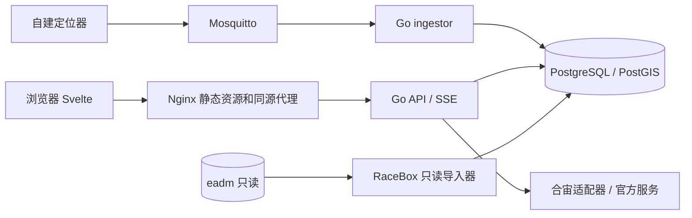

# 技术落地方案

## ADR-001：默认技术栈

选择 Svelte 5 + TypeScript + Vite + SvelteKit 静态 SPA（adapter-static），统一 shadcn-svelte / Tailwind 4 / Lucide；地图 MapLibre GL JS；Go 提供 HTTP、SSE、MQTT 入库。SvelteKit 仅承担前端构建/路由，不增加生产 Node 服务。Svelte 组件中的地图实例只在浏览器 mount 时创建，销毁时解绑。

用户允许 Go/Rust 替代 Erlang，因此首版采用 Go：一个代码库可生成 server、ingestor、import-racebox 三个二进制，部署及后续 AI 接手更直接。Erlang 的 OTP 监督树和 epgsql 经验保留为设计参考；不同时维护两种后端。若明确改回 Erlang，应先写 ADR 并更新契约、镜像、测试计划，不能静默更换。

Go 使用标准 net/http、pgx 连接池、SQL migration 工具；MQTT 使用 Eclipse Paho Go，版本选择时验证手动 ACK 功能。无需 Redis/Kafka，初期 PostgreSQL 保存持久事件。依赖精确版本由 T01 兼容性验证后写 lockfile/go.sum；不要在文档猜未来 patch 版本。

## ADR-002：数据源隔离

统一接口模型 `DeviceProvider`：ListProjects、ListDevices、GetLatest、GetTrack、Capabilities。local 和 racebox_demo 从本库读取；luatos 的登录/读取方式必须先验证官方允许的部署模型。

首选独立站+BFF：浏览器只持本项目 HttpOnly 会话，Go 服务端保存短期上游会话且只代理白名单读接口。**这是待验证设计**，如果平台仅支持托管页面或限制回调，则 T00 要形成正式替代 ADR：保留静态前端构建用于平台托管，按平台官方规定建立认证适配层，自建系统仍独立运行。不得声称改一个 return_to 即可接通。前端业务组件不直接耦合上游响应。

自建租户与上游账号建立明确绑定，授权成功后才建立；未知设备不自动绑定。LUATOS token 不写日志，不出现在 SSE、URL 分享或持久业务 DTO。服务端加密存储时使用应用外部密钥；退出删除该会话缓存。不要把所有用户合并成一个演示账号代理。

## ADR-003：MQTT 与实时可靠性

Broker 是消息传输组件，不是业务后端。ingestor 使用固定 client_id、持久会话、QoS1、指数退避重连、有限 worker 和队列。payload <=16KiB；数据库事务持久化事件、位置、最新状态与 outbox 后才 ACK。数据库故障时暂停消费/重连，禁止确认未持久化数据。Broker 持久化卷和会话恢复需做进程崩溃实测；QoS1 不宣称端到端 exactly-once。

合法重复视为成功但不重复发业务事件；同事件 ID 不同载荷隔离为冲突。毒消息持久化错误类别及受限长度/脱敏摘要，再 ACK；不能永久堵塞队列。topic 与设备凭据不匹配由 Broker ACL 拒绝，业务再校验设备注册与 source 绑定。

SSE 读取 PostgreSQL outbox，NOTIFY 仅作唤醒，不能作为唯一队列。每租户按游标补发，慢客户端有界缓冲；游标过期通知前端重拉快照。多 API 副本各自读取授权事件，不能用抢占消费导致部分客户端丢通知。

## ADR-004：开源与地图

应用沿用仓库 MIT；新增依赖记录 THIRD_PARTY_NOTICES。MapLibre 仅提供渲染，底图必须配合法取得的 WGS84/WebMercator 瓦片/样式/字体/精灵资源并保留归属。开发底图不是商业部署 SLA；公开部署优先自托管区域 OSM 数据，标注 ODbL 与数据来源，不复制演示站 key，不默认调用未授权高德瓦片。

TimescaleDB 的 Apache 2 核心与 TSL 扩展功能不同；严格“全部开源”的可分发部署使用 Apache 2 构建并验证 hypertable 功能，或 Postgres 原生时间分区。当前本地 TimescaleDB 已安装，但安装成功不证明其发行包所有功能满足 OSI。首版不用 TSL 专属压缩、连续聚合/策略作硬依赖；定期清理由自有 job 执行。T02 应验证 Apache 构建与 PG18/PostGIS 组合；不兼容则选择已验证 PG 主版本的容器组合并记录，已有 PG18 数据不能直接挂载给另一主版本。

## ADR-005：T01 前端静态 SPA 与开发代理（2026-09-05）

SvelteKit 仅做静态 SPA：`adapter-static` + `fallback: index.html`，根布局 `ssr=false/prerender=false`。路由全部由浏览器渲染，保证后续任意路径由 Nginx SPA fallback 服务。开发期 Vite `server.proxy['/api'] → http://127.0.0.1:8080` 与部署期 Nginx 反代保持一致——浏览器永远只请求同源 `/api/v1`。设计 token（背景/前景/primary/border/success/warning/danger/ring/radius）集中在 `web/src/app.css` 的 CSS 变量并通过 `@theme inline` 映射到 Tailwind 类，为 shadcn-svelte 组件提供统一基线。

## ADR-006：T01 健康就绪注册表（2026-09-05）

`/api/v1/health/live` 只回答进程存活，不含内部连接信息。`/api/v1/health/ready` 求值注册表中的必需依赖检查；T01 尚无依赖所以 `components` 为空且 `ready=true`（诚实反映“当前没有已注册的必需依赖”），T02 将注册 DB/迁移检查，之后 DB 故障时自动 503。所有 API 响应使用统一信封与归一化错误码（见 docs/api/openapi.yaml）。

## ADR-007：T01 后端零第三方依赖与 Go 版本（2026-09-05）

T01 server 只用 Go 标准库（net/http + 1.22 method patterns、crypto/rand、log/slog），避免在基线期引入无法核验的依赖；go.mod 声明 `go 1.24.0`（本机 Go 1.27.1 编译，向前兼容）。网络受限环境的 Go 模块代理可用 goproxy.cn，Makefile 通过 `GOPROXY` 变量覆盖，不写死在代码里。ingestor/import-racebox 的 cmd 入口在 T04/T03 交付前是“明确失败（exit 1）+ 说明文字”的桩，不假装能消费/导入（AGENTS：未实现不得假成功）。

## ADR-008：T01 交付不包含 Compose（2026-09-05）

06-deployment 声明“本轮没有应用代码，因此不提供假装能启动的 compose”。T01 的 `make compose-check` 只在 compose 文件存在时校验（T07 交付），当前打印明确提示并不视为通过。CI 的 compose job 同理。

## ADR-009：T02 迁移机制与角色边界（2026-09-05）

- 迁移文件为版本化 SQL（`db/migrations/<NNNN>_<name>.sql`），由自研极简 runner（`backend/cmd/migrate`，pgx）执行：会话级 advisory lock、每文件单事务、`schema_migrations(version,name,checksum,applied_at)` 记账、失败即中止且不污染已提交文件。连接凭据只从 PG* 环境变量读取。
- 角色边界执行数据设计：`iotwong_owner`（无 CREATEROLE）只做迁移与 DDL；`iotwong_app`（LOGIN 最小权限：DB CONNECT、schema USAGE、表 CRUD、序列使用）由一次性管理员脚本经超级用户创建，凭据只在被 git 忽略的 `.env.local`；0005 迁移用 `ALTER DEFAULT PRIVILEGES` 保证后续新建对象自动授予 app。实测 app 可 CRUD 不可 DDL。
- TimescaleDB 只用 Apache-2 核心能力（`create_hypertable by_range`、分块、常规索引、查询）；不用 TSL 压缩/连续聚合/策略，清理由自有 job 承担。本机发行版（PG18.4 + postgis 3.6.4 + timescaledb 2.29.1）的 hypertable/写入/索引已实测通过；容器化 Apache 构建与摘要锁定属于 T07 交付验收，不作为 T02 隐式声明。
- 每次迁移先在一次性临时库全量验证（全新 → 重跑无破坏 → 冒烟 FK/hypertable → 删除），再以 owner 在真实库执行；冒烟样本不进入真实库（ACL 检查用事务+ROLLBACK）。

## ADR-010：T03 RaceBox 导入语义（2026-09-05）

- 原库只读限量：超级用户仅新增 `iotwong_eadm_ro`（CONNECT + schema USAGE + lc_racebox SELECT），不触碰 eadm 对象/数据；导入器源会话 `BeginTx(ReadOnly)` + `statement_timeout=60s`，窗口显式列、ORDER BY id LIMIT。
- 语义决定（沿用 docs/03 导入规范，不改写历史结论）：样本坐标为十进制度 WGS84 直接入库；`speed/heading/accuracy` 单位未核验 → 目标库一律 NULL（UI 不得输出速度/里程）；`fix_status` 单值分布不作有效性门禁；`recorded_at` 由源 year..second+nanoseconds 还原且必须显式 `--source-timezone`（Asia/Shanghai=UTC+8 固定偏移，不依赖容器 tzdata）。
- 幂等设计：`event_id=racebox:<batch8>:<srcid>`、`position_id=UUIDv5(event_id)`、recorded_at 确定性 → 重跑 `ON CONFLICT DO NOTHING` 天然零重复；import_runs 记账支持 running/interrupted 断点续传（last_source_id），done 后重跑为 pass-through 只数重复。
- 默认 dry-run；`--apply` 才写 iotwong（目标角色用应用 app 角色，已验证可写不可 DDL）；空数据/非法年份/月份/纳秒越界/坐标越界 → import_rejections 记账。

## ADR-011：T04 本地链路落地决定（2026-09-05）

- MQTT：ingestor 用固定 client_id、CleanSession=false、QoS1、`SetAutoAckDisabled(true)` 手动 ACK——只有 store.Ingest 事务成功后 `msg.Ack()`；连接事件里（重新）订阅，避免 broker 重启后持久会话丢失导致静默断流（实测修复）。topic 设备段即设备 external_id；Broker ACL 用户名=external_id，`topic write iotwong/v1/devices/<dev>/telemetry` 只允许本机、ingestor `read +/telemetry`（初版 ACL 因用户名与 topic 段不一致导致静默不投递，已修正）。
- 持久化：单事务=ingest_events 账本（payload sha256 冲突比较）→ positions/device_latest（位置只进不退，last_seen 只进不退）→ outbox JSON 最小 DTO → commit → ACK。毒消息（未知设备/窗口外/解析失败）只记 ingest_poison 类别+摘要后 ACK，不堵 topic。
- 鉴权 API：Argon2id 本地账号；会话=DB 存 token sha256、HttpOnly/SameSite=Lax cookie；写接口 CSRF Origin 校验；租户由会话 memberships 决定，请求体从不携带 tenant_id；登录限速（内存 5/min/IP）。
- SSE：/events 按 outbox id 轮询补发 + 15s 心跳注释；NOTIFY/LISTEN 唤醒与游标过期 resync 留待性能/验收轮（A12）再做，页面刷新可用 Last-Event-ID 续传。
- cmd/seed 幂等创建本地 admin + dev-1；sim-send 为可复现验证工具（QoS1、重复、冲突、乱序、future 场景）。

## ADR-012：底图栅格配置与默认视图（2026-09-06）

- 对照（内部项目，非外部受限资源）：eadm 轨迹页用官方 AMap Web JS API 2.0（`AMapLoader` + `amap://styles/fresh`，中心 青岛 `[120.527112, 36.411864]`、初始 zoom 11→13，服务端 `eadm_geo` WGS84→GCJ-02）。**不复制其 Key/securityJsCode**（AGENTS：禁止复制第三方 key），仅采纳“可用配置形态、中心与缩放”作为本仓库等效实现的对照结论。
- 本仓库 MapLibre 栅格等效：`webrd01..04.is.autonavi.com/appmaptile?lang=zh_cn&size=1&scale=1&style=8`，`tileSize 256`、`minzoom 3 / maxzoom 18`。实测（2026-09-06）：该瓦片端点对 Referer 无白名单限制、响应 `access-control-allow-origin: *`、key 可省略，z2..20 均返回 200 `image/png`；headless Chromium 中 29/29 瓦片请求 200 且地图视口为非灰彩色渲染。→ “某些浏览器灰屏”经服务端逐项排除（Referer/Key/CORS/域名限制均不存在），指向客户端网络/DNS 到 `*.is.autonavi.com` 不可达或旧缓存产物；页面保留中心瓦片可读诊断（加载失败给出 Key/白名单/网络提示，设备列表仍可用）。
- 默认视图：WGS84 `HOME_CENTER=[120.527112,36.411864]`（青岛，对齐 eadm 与本仓库 racebox_demo 数据区），初始 `HOME_ZOOM=11`；每次进入地图先尝试 `navigator.geolocation`（4 s 超时，成功后 flyTo zoom 13），拒绝/超时/非安全上下文自动回落默认中心；UI 常驻“回默认中心”按钮支持手动复位。
- 分层不变：WGS84 入库与接口/列表文本；仅地图显示层做 WGS84→GCJ-02（`basemap.ts`）。

## 安全与运维

本地用户密码 Argon2id，随机会话 cookie HttpOnly、Secure（生产）、SameSite=Lax；写接口验证 Origin + CSRF token，登录限速。RBAC viewer/admin；租户边界必须覆盖列表、单设备、轨迹、SSE、导出及 SQL。单机阶段应用强制 tenant 过滤并测试；RLS 可后续加固，不能只靠 UI 隐藏。

UTC timestamptz 入库；可观测指标包含 accepted/rejected/duplicate、ingest lag、DB pool、SSE clients、上游超时。日志字段 request_id/source/device内部ID/error_code，避免原始位置和认证信息。HTTP优雅停机；ingestor 停止接新消息并等待事务收尾。备份还原必须在隔离库演练。
